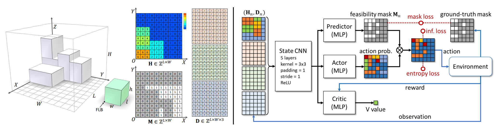

# Online 3D Bin Packing with Constrained Deep Reinforcement Learning




## Online-3D-BPP-DRL

Video link of our project: [YouTube](https://www.youtube.com/watch?v=hBzZA_21G3M&t=6s), [bilibili](https://www.bilibili.com/video/BV1st4y1H7kU/?vd_source=b1e4277847248c95062cf16ab3b58e73)

This repository contains the implementation of the paper [Online 3D Bin Packing with Constrained Deep Reinforcement Learning](https://arxiv.org/pdf/2006.14978.pdf).


## Install

```
To make this project work, there are two things you should do:
* Install Python packages in 'requirements.py' (by 'pip install -r requirements.txt').
* (This code works on Python 3.7)
```

## Run
We provide a unified interface in 'main.py'. There are examples of running our project.

For training：
```
Example: Train a new model on sequences generated randomly.
You can run 'python main.py --mode train --use-cuda --item-seq rs'.
It will take about one day to get a model with satisfying performance.

You can run 'python main.py --help' for some information of common parameters.
There are many other parameters of our project in 'arguments.py', and all of them are given default values. You can change it if you like.
```

For test:
```
Example:
If you want to test a model trained on sequences generated by CUT-2 Algorithm(get more details in our article).
You can run 'python main.py --mode test --load-model --use-cuda --data-name cut_2.pt --load-name default_cut_2.pt'.

If you want to see how the model works in a lookahead setting,
You can run 'python main.py --mode test --load-model --use-cuda --data-name cut_2.pt --load-name default_cut_2.pt --preview x', x is the lookahead number.

Codes of user-study applications, multi-bin algorithm, and MCTS for comparison are also provided,
Please check 'user_study/', 'multi_bin/', 'MCTS/' for details.
```

## Tips
```
* Different input state sizes need different kinds of CNN for encoding, you can adjust the network architecture in ./acktr/model.py to satisfy your needs. 

* Predicted mask is mainly for reducing MCTS computing costs. If you only need the BPP-1 model, you can replace the predicted mask with a ground-truth mask during the training and it will be easy for training.

* If you relax the constraint of stability rules, you may get a better result, but it may be dangerous in practice.

* The computing overhead of our implementation is sensitive to the length of the network layer, you should avoid a large network layer appearing in your network architecture. 

* Bin packing problem's difficulty is related to its item set. The trained model's performance is also affected by it.
```

## Statement
```
Hang Zhao and Qijin She are co-authors of this repository.

Some codes are modified from the open-source project 'pytorch-a2c-ppo-acktr-gail' (https://github.com/ikostrikov/pytorch-a2c-ppo-acktr-gail).
```

## License
```
Note that this source code is released only for academic use. Please do not use it for commercial purposes without authorization of the authors. The method is being patent protected. For commercial use, please contact Kai Xu (kevin.kai.xu@gmail.com).
```

## Citation

If you are interested, please cite the following paper:

```shell
@inproceedings{DBLP:conf/aaai/ZhaoS0Y021,
  author    = {Hang Zhao and
               Qijin She and
               Chenyang Zhu and
               Yin Yang and
               Kai Xu},
  title     = {Online 3D Bin Packing with Constrained Deep Reinforcement Learning},
  booktitle = {Thirty-Fifth {AAAI} Conference on Artificial Intelligence, {AAAI}
               2021, Thirty-Third Conference on Innovative Applications of Artificial
               Intelligence, {IAAI} 2021, The Eleventh Symposium on Educational Advances
               in Artificial Intelligence, {EAAI} 2021, Virtual Event, February 2-9,
               2021},
  pages     = {741--749},
  publisher = {{AAAI} Press},
  year      = {2021},
  url       = {https://ojs.aaai.org/index.php/AAAI/article/view/16155},
  timestamp = {Wed, 02 Jun 2021 18:09:11 +0200},
  biburl    = {https://dblp.org/rec/conf/aaai/ZhaoS0Y021.bib},
  bibsource = {dblp computer science bibliography, https://dblp.org}
}
```
## 程式碼解說
好的，這份程式碼是 [Online 3D Bin Packing with Constrained Deep Reinforcement Learning](https://arxiv.org/pdf/2006.14978.pdf)  這篇論文的實作。我將會詳細解釋此程式碼的架構，以及當您運行 `main.py` 進行訓練時，程式會如何運作。

### **程式碼整體架構**

這個專案的目標是使用深度強化學習來解決三維裝箱問題（3D Bin Packing Problem, 3D-BPP）。程式碼的結構可以分為以下幾個主要部分：

1.  **主程式與參數 (Main Program and Arguments)**
    * `main.py`：整個程式的進入點，負責解析命令行參數，並根據參數決定要進行模型訓練或是測試。 
    * `acktr/arguments.py`：定義了所有可配置的參數，例如學習率、環境名稱、容器大小等，並提供預設值。 

2.  **強化學習核心 (Reinforcement Learning Core)**
    * `acktr/`：此目錄包含了強化學習算法的核心實作，基於一個開源專案 `pytorch-a2c-ppo-acktr-gail` 修改而來。
        * `acktr/model.py`：定義了神經網路的架構，也就是我們的策略（Policy）。 專案中實作了 `CNNPro`，一個基於卷積神經網路（CNN）的模型來處理裝箱問題的狀態。 
        * `acktr/algo/`：包含了強化學習算法的實作，例如 `ACKTR` 和 `PPO`。 
        * `acktr/storage.py`：定義了 `RolloutStorage` 類，用於儲存和管理在環境中收集到的經驗（狀態、動作、獎勵等），以供模型訓練使用。 
        * `acktr/envs.py`：負責建立和封裝訓練環境。 

3.  **裝箱問題環境 (Bin Packing Environment)**
    * `envs/bpp0/`：這個目錄定義了 3D 裝箱問題的模擬環境。
        * `envs/bpp0/bin3D.py`：`PackingGame` 類別，實作了 Gym 的環境介面，定義了狀態（observation）、動作（action）、獎勵（reward）和環境重置等功能。 
        * `envs/bpp0/space.py`：`Space` 類別，用來模擬裝箱的空間，並包含檢查物品是否能放置的邏輯。
        * `envs/bpp0/binCreator.py`、`envs/bpp0/cutCreator.py`、`envs/bpp0/mdCreator.py`：這些檔案用來生成不同序列的箱子，模擬不同的裝箱情境。 

4.  **模型評估與測試 (Evaluation and Testing)**
    * `evaluation.py`：提供了評估模型性能的函數，會在訓練過程中定期被呼叫。 
    * `unified_test.py`：用於在訓練完成後，測試模型在特定資料集上的表現。 

5.  **其他工具與演算法 (Other Utilities and Algorithms)**
    * `MCTS/`：包含了蒙地卡羅樹搜尋（Monte Carlo Tree Search, MCTS）的實作，作為比較的基準演算法。 
    * `baselines/`：包含了一些來自 OpenAI Baselines 的通用模組，例如日誌記錄（`logger.py`） 和環境監控（`monitor.py`）。

### **運行 `main.py` 進行訓練的流程**

當您執行 `python main.py --mode train ...` 時，程式會啟動訓練流程，以下是詳細的步驟：

1.  **初始化設定 (Initialization)**
    * `main.py` 接收到 `--mode train` 參數，呼叫 `train_model` 函式。
    * 程式會讀取 `acktr/arguments.py` 中定義的各項參數，例如 `--use-cuda`、`--item-seq` 等。 
    * 接著，它會設定日誌目錄、隨機種子，並根據 `num_processes` 參數建立多個平行的訓練環境。  環境的建立是透過 `acktr/envs.py` 中的 `make_vec_envs` 函式完成的，這個函式會進一步呼叫 `envs/bpp0/bin3D.py` 來產生裝箱環境的實例。 

2.  **建立神經網路模型 (Model Creation)**
    * 在 `train_model` 中，程式會根據 `acktr/model.py` 中定義的 `Policy` 類別來建立神經網路模型。 這個 `Policy` 會使用 `CNNPro` 作為其基礎網路架構，`CNNPro` 特別為處理裝箱問題的二維高度圖（height map）狀態而設計。

3.  **建立強化學習代理人 (Agent Creation)**
    * 根據 `--algorithm` 參數（預設為 `acktr`），程式會從 `acktr/algo/` 中選擇對應的演算法來建立一個代理人（Agent），例如 `algo.ACKTR`。  這個代理人負責根據模型的輸出和收集到的經驗來更新模型的權重。

4.  **經驗收集與儲存 (Rollout Collection and Storage)**
    * 程式會實例化 `acktr/storage.py` 中的 `RolloutStorage` 物件，用來存放每個訓練步驟的資料。 
    * 訓練迴圈開始。在每個迴圈中，程式會執行 `args.num_steps` 次的環境互動。
    * 在每個互動步驟中：
        * 當前的環境狀態（`obs`，即箱子的二維高度圖）會被輸入到模型中。 
        * 模型（`actor_critic`）的 `act` 方法會根據目前的狀態和可行的放置位置（`location_masks`），輸出行（`action`）、預測的價值（`value`）和動作的對數機率（`action_log_prob`）。
        * 將輸出的動作應用到環境中（`envs.step(action)`），環境會回傳新的狀態、獎勵（`reward`）和是否完成的標誌（`done`）。
        * 將這一步收集到的所有資訊（`obs`, `action`, `reward`, `done` 等）儲存到 `RolloutStorage` 中。 

5.  **模型更新 (Model Update)**
    * 當 `num_steps` 的互動完成後，`RolloutStorage` 就會收集到一批經驗。
    * 代理人（`agent`）的 `update` 方法會被呼叫，這個方法會使用 `RolloutStorage` 中的資料來計算損失函數（loss），包含價值損失（value loss）、動作損失（action loss）和熵（entropy）。
    * 接著，使用優化器（`acktr` 中使用的是 `KFACOptimizer`）根據計算出的梯度來更新神經網路模型的權重。 
    * 更新完成後，`RolloutStorage` 會清除舊資料，並將最後一個狀態作為下一次收集的起始狀態。

6.  **日誌記錄與模型儲存 (Logging and Saving)**
    * 程式會定期（根據 `log_interval`）在終端機印出訓練過程中的統計數據，例如平均獎勵、損失值等。
    * 如果開啟了 TensorBoard (`--tensorboard`），相關數據也會被寫入日誌檔案中，以供視覺化分析。
    * 程式也會定期（根據 `save_interval`）將訓練好的模型權重儲存到指定的目錄中（預設為 `./saved_models/`）。

這個訓練流程會持續進行，直到達到預設的總時間步數，或是手動停止。整個過程就是不斷地讓代理人在模擬的裝箱環境中進行嘗試，並從中學習如何做出更好的放置決策，以最大化空間利用率。