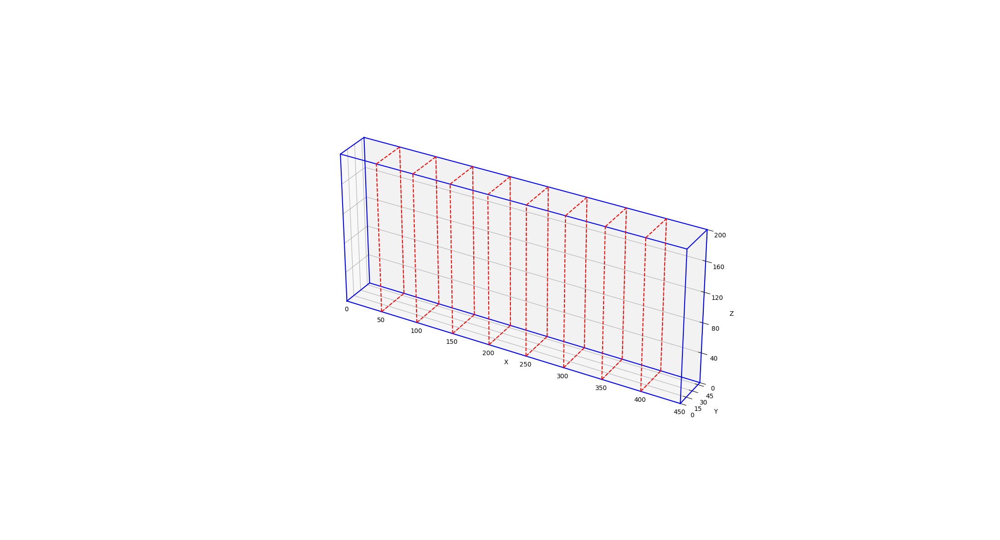

# 1D Bin Packing for AS/RS Height Optimization

## 專案概述

- 即時動態儲位指派情境：針對倉儲作業中有新貨物需要立刻入庫的情形，系統將即時為單一儲位群組（例如特定巷道或區域）的新進貨物推薦適當的儲存位置。目標是在不延誤自動化設備運轉的前提下，快速決定每件貨物應存放於哪個儲位，以平衡倉儲空間利用與取貨效率。
- 靜態批次儲位最佳化情境：針對較長時間尺度的入庫規劃或庫存重組，系統可在離線模式下對單一儲位群組內的多筆貨物安排最優儲位配置。目標是最佳化全局的儲位使用效率，包括提高空間利用率、降低未來取貨路徑距離以及避免某些區域過度集中存放導致作業瓶頸。  
以下面的示意圖為例：  
這是由9個小貨櫃所組成的大貨櫃，貨物由入口放進去後，系統會自動安排該將貨物放入哪個櫃子。



## 功能特色

- 線上即時入庫: 模擬新貨物抵達時，系統採用 首次適應 (First Fit) 演算法，依照預設的儲位優先順序，為貨物尋找第一個可行的儲位 。
- 離線儲位重組: 在系統離峰時段，採用 最佳適應 (Best Fit) 演算法對所有儲位中的貨物進行重新整理 。此演算法會將貨物以高度優先排序，並嘗試將它們堆疊以最大化空間利用率，減少總體堆疊高度 。
- 貨物檢索: 可根據貨物 ID 從系統中搜尋並取回指定的貨物 。
- 3D 視覺化: 提供將任何一個儲位 (Bin) 的內部堆疊情況進行 3D 視覺化的功能，並可選擇在圖上顯示貨物 ID，方便分析與展示。


## 結果呈現

在online放入物品的狀況中，以動畫呈現如下：


## 專案結構
```
.  
└── AS-RS/  
    └── height_only/  
        ├── README.md  
        ├── ASRSManager.py         # ASRS 系統核心管理程式  
        ├── main.py                # 主程式進入點  
        ├── config.yaml            # 儲位尺寸與優先權設定檔  
        ├── items.csv              # 待入庫的貨物資料  
        ├── item.py                # 定義 Item 物件  
        ├── bin.py                 # 定義 Bin 物件  
        ├── utils.py               # 通用工具函式  
        ├── algorithms/            # 演算法資料夾  
        │   ├── best_fit.py  
        │   └── first_fit.py  
        └── visualization/         # 視覺化資料夾  
            └── visualization.py  
```

## API 使用範例

所有主要功能都封裝在 `ASRSManager` 類別中。以下將透過 `main.py` 的程式碼，說明如何使用各個 API。

### 1. 初始化 ASRSManager

您可以透過 `config.yaml` 設定檔或直接傳遞參數來初始化 `ASRSManager`。

**方法一：使用 `config.yaml`**
`config.yaml` 檔案內容如下，您可以設定儲位大小、權重限制，以及線上和離線操作的儲位優先順序。

```yaml
online_priority: [5, 4, 6, 3, 7, 2, 8, 1, 9]

offline_priority: [1, 9, 2, 8, 3, 7, 4, 6, 5]

bin_config:
  width: 50
  height: 230
  depth: 50
  min_adjust_length: 5
  weight_limit: 17
```

然後在程式碼中這樣初始化：

```python
from ASRSManager import ASRSManager

# 只需要提供設定檔路徑
manager = ASRSManager(config_path='./config.yaml')
```

**方法二：直接傳遞參數**
您也可以直接在程式碼中定義參數並初始化。

```python
import yaml
from ASRSManager import ASRSManager

# 讀取設定檔來取得參數
online_priority = [5, 4, 6, 3, 7, 2, 8, 1, 9]
offline_priority = [1, 9, 2, 8, 3, 7, 4, 6, 5]
bin_config = config['bin_config']
bin_dimensions = (50, 230, 50, 5)   # width, height, depth, min_adjust_length
weight_limit = 17

# 將參數傳入 manager
manager = ASRSManager(online_priority=online_priority,
                       offline_priority=offline_priority,
                       bin_dimensions=bin_dimensions,
                       weight_limit=weight_limit)
```

### 2. 線上操作 (放置物品)

`place_item_online` 方法會使用 First Fit 演算法，為新進物品尋找存放位置。

```python
import pandas as pd
from item import Item
import copy

# 從 CSV 讀取物品清單
item_list = []
df = pd.read_csv("./items.csv")
for row in df.itertuples(index=False):
    item_list.append(Item(row.width, row.height, row.depth, row.can_rotate, row.weight, row.id))

# 依序將物品放入
for item in item_list:
    result = manager.place_item_online(item)    # 回傳一個bool，表示是否放置成功
    if not result:
        print(f"failed to place item {item.id} online.")
```

### 3. 離線重組

當系統處於離峰時段，`reorganize_offline` 方法會使用 Best Fit 演算法，將所有物品重新整理，以達到最佳的空間利用率。

```python
reorg_result = manager.reorganize_offline() # 回傳一個bool，表示是否放置成功

if reorg_result:
    print(f"reorganization successful!")
else:
    print(f"reorganization failed.")
```

### 4. 檢索物品

`retrieve_item` 方法可以根據物品 ID，從系統中找到並回傳該物品的物件。

```python
retrieved_item_id = 10
retrieved_item = manager.retrieve_item(retrieved_item_id)  # 回傳一個 Item 物件或 None

if retrieved_item:
    print(f"Retrieved item {retrieved_item.id} placed at bin {retrieved_item.placed_bin} at position {retrieved_item.position}.")
else: 
    print(f"Item {retrieved_item_id} not found.")
```

### 5. 移除物品

`remove_item` 方法不僅會移除指定的物品，還會將該物品上方的所有物品向下移動，填補空缺。

```python
item_to_remove_id = 10

# 執行移除操作
_, moved_items = manager.remove_item(item_to_remove_id) # 回傳：是否成功, 被移動的所有物品列表

# 檢查移除後的結果
print ("=== after removing ===")
# ... (檢查 bin 內物品位置的程式碼)
```

### 6. 視覺化儲位

`visualize_bins` 方法可以將指定的儲位內部情況繪製成 3D 圖，方便觀察。

```python
bin_id_to_visualize = 2
# 直接顯示圖表
manager.visualize_bins(bin_id=bin_id_to_visualize)

# 或是將圖表儲存成檔案
manager.visualize_bins(bin_id=bin_id_to_visualize, save_path="./bin_visualization.png")
```

### 7. 產生線上放入物品時的 GIF 動畫

您可以記錄線上入庫的每一步，並使用 `create_animation` 函式生成 GIF 動畫。

```python
from visualization.animation import create_animation
# online_history 是一個記錄每一步 manager.bins 狀態的 list
# placed_sequence 是一個記錄每一步放置了哪個 item 的 list

create_animation(
    history=online_history,
    placed_item_sequence=placed_sequence,
    manager=manager,
    output_filename="online.gif"
)
```

## 如何執行

1.  **參數設定 (`config.yaml`)**：

      - `bin_dimensions`: 設定儲位的物理尺寸（寬、高、深）以及可調整的最小高度單位。
      - `online_priority`: 設定線上作業時，系統嘗試放置貨物的儲位 ID 順序。
      - `offline_priority`: 設定離線重組時，使用的儲位 ID 順序。

2.  **準備貨物資料 (`items.csv`)**：
    您可以手動建立 `items.csv`，或執行 `random_item.py` 來生成隨機的貨物資料。
    windows:
    ```bash
    python random_item.py
    ```

    mac:
    ```bash
    python3 random_item.py
    ```
3.  **執行主程式**：
    `main.py` 中包含了上述所有功能的使用範例，您可以直接執行或參考其寫法來開發您的應用。
    windows:

    ```bash
    # 各種使用範例皆在 main.py 中可參考
    python main.py
    ```
    mac:
    ```bash
    python3 main.py
    ```