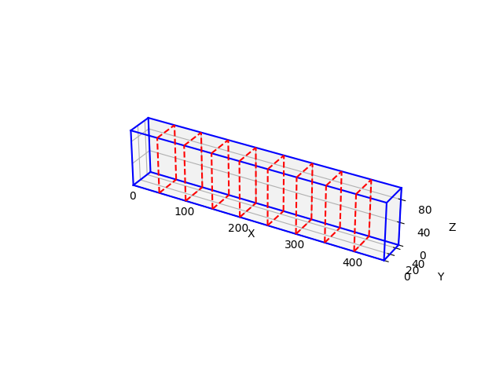

# 1D Bin Packing for AS/RS Height Optimization

## 專案概述

- 即時動態儲位指派情境：針對倉儲作業中有新貨物需要立刻入庫的情形，系統將即時為單一儲位群組（例如特定巷道或區域）的新進貨物推薦適當的儲存位置。目標是在不延誤自動化設備運轉的前提下，快速決定每件貨物應存放於哪個儲位，以平衡倉儲空間利用與取貨效率。
- 靜態批次儲位最佳化情境：針對較長時間尺度的入庫規劃或庫存重組，系統可在離線模式下對單一儲位群組內的多筆貨物安排最優儲位配置。目標是最佳化全局的儲位使用效率，包括提高空間利用率、降低未來取貨路徑距離以及避免某些區域過度集中存放導致作業瓶頸。



## 功能特色

- 3D 空間模擬：以 3D 向量（寬、高、深）表示物品與貨櫃尺寸。
- 垂直堆疊最佳化：演算法專為垂直堆疊設計，主要目標是最小化堆疊的總高度。 
- 兩種演算法實作：
    * Best Fit (離線)：一次性取得所有物品清單，透過排序與評分，找出能讓每個物品放置後總高度增加最少的最佳位置。
    * First Fit (線上)：模擬物品一件件抵達的情境，並將物品放入第一個找到的、足夠容納的貨櫃中。
- 物品旋轉：支援物品旋轉，以找出最節省高度的擺放方式。
- 可調整的貨架高度：獨特的 `min_adjust_length` 參數，讓模擬更貼近真實倉儲情境。 

## 專案結構


height_only/  
    ├── main.py             # 專案主程式進入點  
    ├── item.py             # 定義 Item 物件  
    ├── bin.py              # 定義 Bin (貨櫃) 物件  
    ├── best_fit.py         # 實作 Best Fit 演算法  
    ├── first_fit.py        # 實作 First Fit 演算法  
    ├── random_item.py      # 隨機產生隨機物品資料，可以於下方config設定各種參數  
    └── items.csv           # 從random_item.py產生出來的csv檔案，主程式main.py也會從這裡讀入物品清單  


## 核心元件

* `main.py`
    * 專案的執行進入點。
    * 可以在此處定義要放入的物品清單 (`item_list_data`) 和貨櫃的尺寸 (`bin_dimensions`)。
    * 依序執行 Best Fit 和 First Fit 演算法並印出結果。
* `item.py`
    * 定義 `Item` class，包含物品的寬、高、深、ID，以及是否允許旋轉等屬性。
* `bin.py`
    * 定義 `Bin` class，代表一個貨櫃，包含一個貨櫃可以容納的長寬高，以及最小調整高度。
    * 負責管理貨櫃中的物品、檢查物品是否能被放置（邊界與重疊檢查），以及計算目前已用高度。
* `best_fit.py`
    * 實作離線的 Best Fit 演算法。它會先將物品按照高度排序，然後為每個物品尋找所有現有貨櫃中的最佳位置。
* `first_fit.py`
    * 實作線上的 First Fit 演算法。目前的策略是「高度最小優先」：先為物品找出一個高度最小的最佳擺放方式，然後拿這個固定的方式去尋找第一個能放下的貨櫃。

## 主要演算法:
若貨物能翻轉：將貨物翻轉至高度較低的情況。
若貨物無法翻轉：照貨物原樣放入櫃子

first fit:遍歷所有已放入貨物的櫃子，若有空間可以放入這個貨物就放入，若沒有的話就開一個新的櫃子。
best fit:先將貨物清單根據高度進行排序，從最高的貨物依序放入。遍歷所有已放入貨物的櫃子，並給予每個櫃子一個分數。分數的給法是：若櫃子放入這個貨物的話，剩餘的高度越少，分數越高，最後會把貨物放入分數最高的櫃子裡面。

## 執行：
``` bash
# 產生隨機貨物清單
python ramdom_item.py
# 執行程式碼
python main.py
# 會於終端機列印出兩演算法裝箱的情況
```

## 實驗結果：
貨物：200個
first fit: 使用了32個bin
best fit: 使用了31個bin