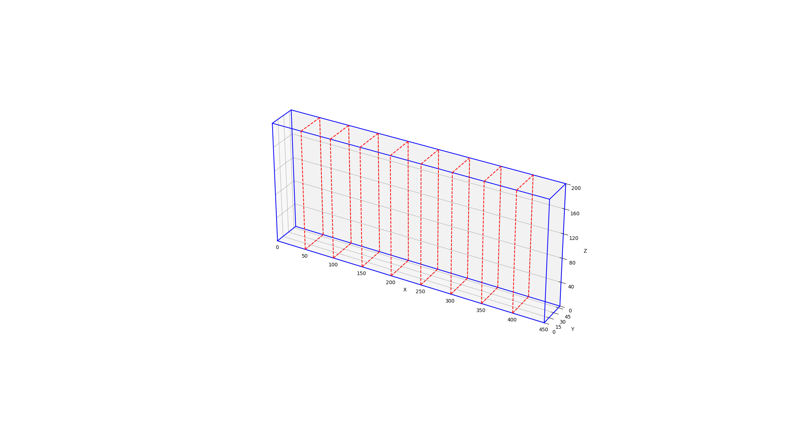
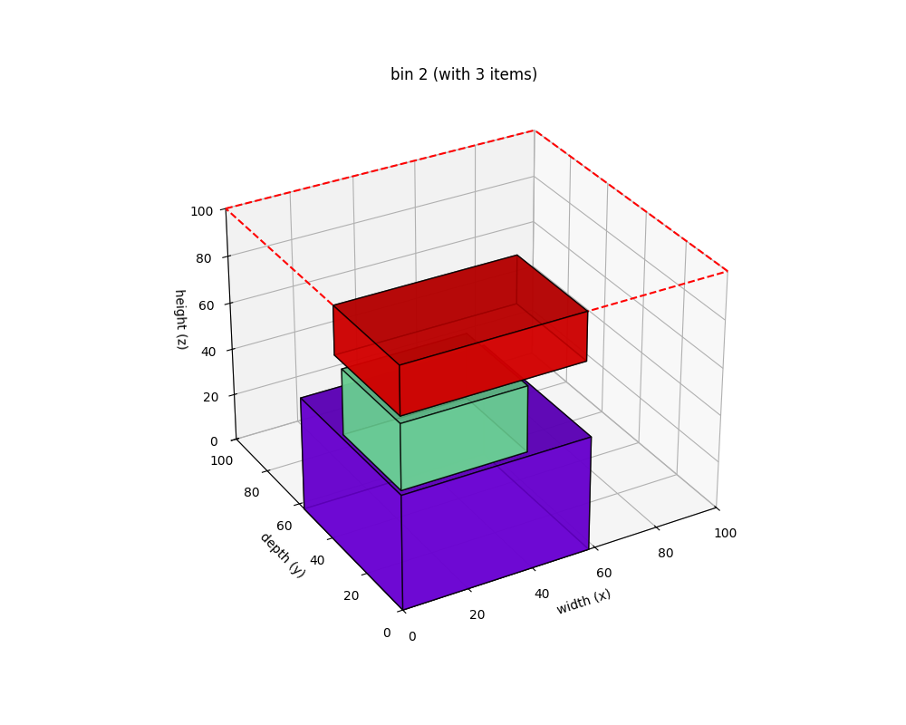
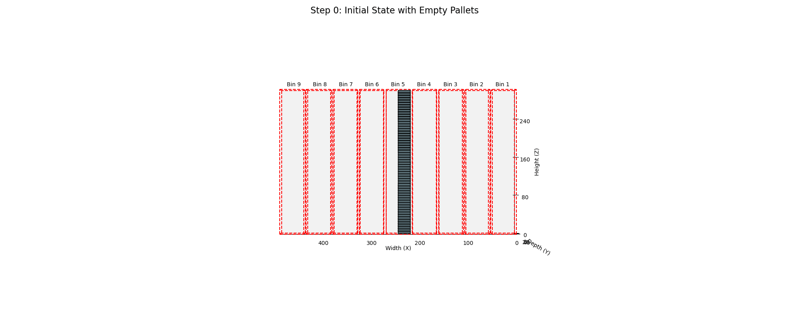

# 1D Bin Packing for AS/RS Height Optimization

## 專案概述

- 即時動態儲位指派情境：針對倉儲作業中有新貨物需要立刻入庫的情形，系統將即時為單一儲位群組（例如特定巷道或區域）的新進貨物推薦適當的儲存位置。目標是在不延誤自動化設備運轉的前提下，快速決定每件貨物應存放於哪個儲位，以平衡倉儲空間利用與取貨效率。
- 靜態批次儲位最佳化情境：針對較長時間尺度的入庫規劃或庫存重組，系統可在離線模式下對單一儲位群組內的多筆貨物安排最優儲位配置。目標是最佳化全局的儲位使用效率，包括提高空間利用率、降低未來取貨路徑距離以及避免某些區域過度集中存放導致作業瓶頸。  
以下面的示意圖為例：  
這是由9個小貨櫃所組成的大貨櫃，貨物由入口放進去後，系統會自動安排該將貨物放入哪個櫃子。



## 功能特色

- 線上即時入庫: 模擬新貨物抵達時，系統採用 首次適應 (First Fit) 演算法，依照預設的儲位優先順序，為貨物尋找第一個可行的儲位 。
- 離線儲位重組: 在系統離峰時段，採用 最佳適應 (Best Fit) 演算法對所有儲位中的貨物進行重新整理 。此演算法會將貨物以高度優先排序，並嘗試將它們堆疊以最大化空間利用率，減少總體堆疊高度 。
- 貨物檢索: 可根據貨物 ID 從系統中搜尋並取回指定的貨物 。
- 3D 視覺化: 提供將任何一個儲位 (Bin) 的內部堆疊情況進行 3D 視覺化的功能，並可選擇在圖上顯示貨物 ID，方便分析與展示。



## 結果呈現

在online放入物品的狀況中，以動畫呈現如下：


## 專案結構
```
.
├── algorithms
│   ├── best_fit.py     # 離線最佳化儲櫃空間的演算法
│   └── first_fit.py    # 線上即時儲存貨物的演算法
├── api.py              # 利用fastapi包裝ASRSManager的框架
├── ASRSManager.py      # 創建一個ASRSManager物件，包裝所有功能
├── bin.py              # 定義儲櫃的物件
├── config.yaml         # 預設的儲櫃設定
├── item.py             # 貨物、空棧板等的物件定義
├── README.md
├── utils.py            # 用於存放需要用到的函式
└── visualization
    ├── animation.py    # 繪製動畫需要
    ├── schematic.py    # 繪製儲櫃概念圖
    └── visualize_bin.py    # 顯示某一個儲櫃的貨物放置狀態
```

## 使用API
```bash
uvicorn api:app --reload 
# reload 可加可不加
```

接著就能透過gui介面進行操作

## 主要功能：
1. POST /items - 線上新增單一貨物
    - 功能說明: 用於處理即時的新貨物入庫需求。當有一件新貨物需要存放時，呼叫此 API，系統會接收貨物的尺寸、重量等資訊。
    - 核心演算法: 內部會呼叫 ASRSManager 的 place_item_online 方法，此方法採用 首次適應 (First-Fit) 演算法，依照 config.yaml 中 online_priority 設定的儲位順序，為貨物尋找第一個符合條件的儲位。
    - 回傳: 成功時，會回傳詳細的放置計畫，包含使用的棧板 ID、最終放置的儲位與座標；失敗則會回傳錯誤訊息。
    - 輸入範例：
    ```
    {
        "width": 0,
        "height": 0,
        "depth": 0,
        "weight": 0,
        "can_rotate": false,
        "empty": false,
        "cargo_id": "string"
    }
    ```
    - 回傳範例：
    ```
    {
        "success": true,
        "original_pallet_placed_bin": "string",
        "original_pallet_position": [
            null,
            null,
            null
        ],
        "target_bin": "string",
        "target_position": [
            null,
            null,
            null
        ],
        "pallet_id": "string",
        "item": {
            "additionalProp1": {}
        }
    }
    ```

2. POST /reorganize - 離線儲位重組
    - 功能說明: 觸發離線的倉儲重組作業。此功能適用於系統離峰或閒置時段，可對現有已入庫的所有貨物進行全面的位置優化。
    - 核心演算法: 系統會呼叫 reorganize_offline 方法，此方法會採用 最佳適應 (Best-Fit) 演算法，將所有貨物依照高度排序，並重新堆疊，目標是最大化空間利用率並降低整體的堆疊高度。
    - 回傳: 回傳重組後所有貨物的新位置。
    - 輸入:無需輸入任何資訊
    - 回傳範例：
    ```
    {
        "status": "success",
        "new_placements": {
            "pallet_id": {
            "new_bin": "string",
            "new_position": [
                null,
                null,
                null
            ]
            },
            "pallet_id": {
            "new_bin": "string",
            "new_position": [
                null,
                null,
                null
            ]
            },
            "pallet_id": {
            "new_bin": "string",
            "new_position": [
                null,
                null,
                null
            ]
            }
        }
    }
    ```

3. GET /items - 查詢所有貨物
    - 功能說明: 獲取倉儲系統中所有已存入（非空棧板）的貨物列表。
    - 使用情境: 可用於盤點、或取得所有貨物的概覽。
    - 回傳: 回傳一個包含所有貨物詳細資訊的列表。
    - 輸入：無需輸入任何資訊
    - 回傳範例：
    ```
    {
        "pallet_id": {
            "pallet_id": "string",
            "cargo_id": "string",
            "width": 0,
            "height": 0,
            "depth": 0,
            "weight": 0,
            "rotation": true,
            "empty": true,
            "position": [
            null,
            null,
            null
            ],
            "placed_bin": 0,
            "placed_dimensions": [
            null,
            null,
            null
            ]
        },
        "pallet_id": {
            "pallet_id": "string",
            "cargo_id": "string",
            "width": 0,
            "height": 0,
            "depth": 0,
            "weight": 0,
            "rotation": true,
            "empty": true,
            "position": [
            null,
            null,
            null
            ],
            "placed_bin": 0,
            "placed_dimensions": [
            null,
            null,
            null
            ]
        },
        "pallet_id": {
            "pallet_id": "string",
            "cargo_id": "string",
            "width": 0,
            "height": 0,
            "depth": 0,
            "weight": 0,
            "rotation": true,
            "empty": true,
            "position": [
            null,
            null,
            null
            ],
            "placed_bin": 0,
            "placed_dimensions": [
            null,
            null,
            null
            ]
        }
    }
    ```

4. GET /items/{item_id} - 查詢特定貨物
    - 功能說明: 根據棧板 ID (pallet_id) 或貨物 ID (cargo_id) 來查詢特定貨物的詳細資訊，包含其所在的儲位與座標。
    - 使用情境: 當需要找尋某一件特定貨物時使用。
    - 回傳: 成功時回傳該貨物的完整資料；若找不到則回傳 404 Not Found 錯誤。
    - 輸入: (pallet_id: Optional[str] = None, cargo_id: Optional[str] = None)，兩者其中一個
    - 回傳範例:
    ```
    {
        "pallet_id": "string",
        "cargo_id": "string",
        "width": 0,
        "height": 0,
        "depth": 0,
        "weight": 0,
        "rotation": true,
        "empty": true,
        "position": [
            null,
            null,
            null
        ],
        "placed_bin": 0,
        "placed_dimensions": [
            null,
            null,
            null
        ]
    }
    ```

5. DELETE /items/{item_id} - 移除特定貨物
    - 功能說明: 根據棧板 ID (pallet_id) 或貨物 ID (cargo_id) 將指定的貨物從系統中取出。
    - 系統運作: 當貨物被取出後，其原先佔用的棧板會被清空，並作為一個空棧板被送回到指定的空棧板儲存區，以供後續使用。
    - 回傳: 成功時回傳操作成功的訊息以及該空棧板的最終狀態；失敗則回傳錯誤訊息。
    - 輸入: (pallet_id: Optional[str] = None, cargo_id: Optional[str] = None)，兩者其中一個
    - 回傳範例：
    ```
    {
        "success": true,
        "item": {
            "pallet_id": "string",
            "cargo_id": "string",
            "width": 0,
            "height": 0,
            "depth": 0,
            "weight": 0,
            "rotation": true,
            "empty": true,
            "position": [
            null,
            null,
            null
            ],
            "placed_bin": 0,
            "placed_dimensions": [
            null,
            null,
            null
            ]
        }
    }
    ```

6. POST /batch-place - 批次放置貨物
    - 功能說明: 此為一項輔助功能，允許使用者一次性地將多筆貨物資料（包含預先指定的儲位和座標）登錄到系統中。
    - 使用情境: 主要用於系統重啟後，快速恢復或還原倉儲狀態，而不需要透過演算法逐一重新計算位置。
    - 回傳: 回傳批次放置的執行結果。
    - 輸入範例: 一次輸入兩個物品
    ```
    [
        {
            "pallet_id": "1",
            "cargo_id": "s1",
            "width": 10,
            "height": 10,
            "depth": 10,
            "weight": 10,
            "can_rotate": false,
            "empty": false,
            "position": [
            0,
            0,
            0
            ],
            "placed_bin": "string",
            "placed_dimensions": [
            10,
            10,
            10
            ]
        },
        {
            "pallet_id": "2",
            "cargo_id": "s2",
            "width": 10,
            "height": 10,
            "depth": 10,
            "weight": 10,
            "can_rotate": false,
            "empty": false,
            "position": [
            0,
            0,
            0
            ],
            "placed_bin": "2",
            "placed_dimensions": [
            10,
            10,
            10
            ]
        }
    ]
    ```
    - 回傳範例：
    ```
    [
        {
            "pallet_id": "string",
            "cargo_id": "string",
            "width": 0,
            "height": 0,
            "depth": 0,
            "weight": 0,
            "can_rotate": false,
            "empty": false,
            "position": [
            null,
            null,
            null
            ],
            "placed_bin": "string",
            "placed_dimensions": [
            null,
            null,
            null
            ]
        },
        {
            "pallet_id": "string",
            "cargo_id": "string",
            "width": 0,
            "height": 0,
            "depth": 0,
            "weight": 0,
            "can_rotate": false,
            "empty": false,
            "position": [
            null,
            null,
            null
            ],
            "placed_bin": "string",
            "placed_dimensions": [
            null,
            null,
            null
            ]
        }
    ]
    ```

7. GET / - API 根目錄
    - 功能說明: API 的根目錄，會回傳一個歡迎訊息，並引導使用者前往 /docs 路徑查看互動式 API 文件。